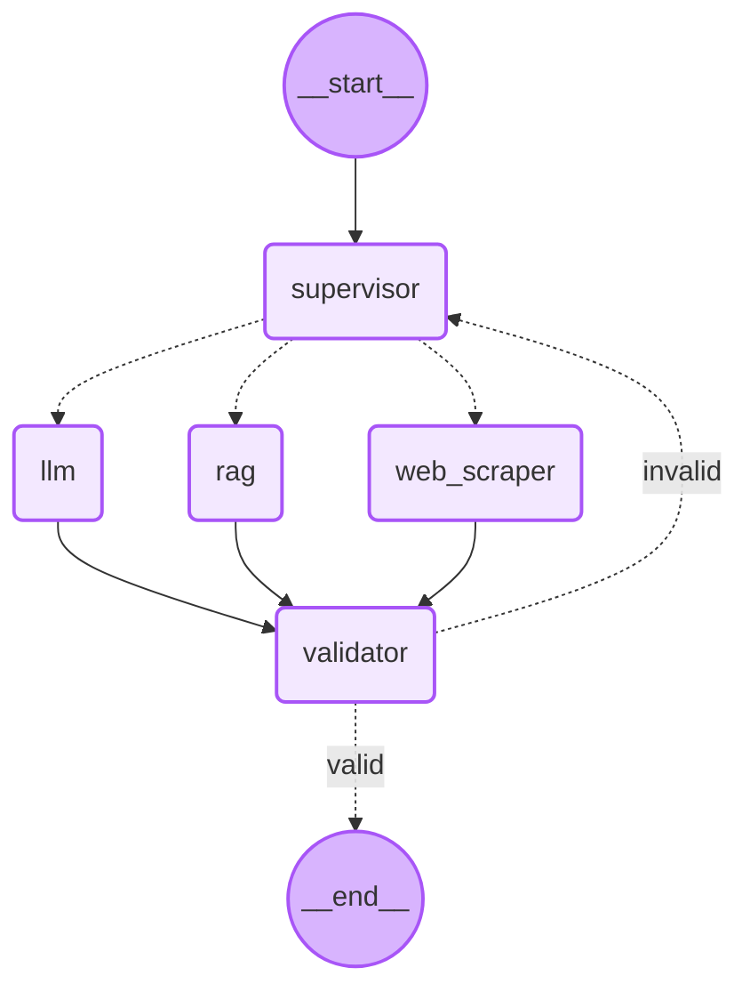

# VeriGraph-AI 🛡️

**VeriGraph-AI** is an advanced agentic AI system built with **LangGraph** and **LangChain** that orchestrates a team of specialized AI workers to answer complex user queries. The system features an intelligent supervisor that routes tasks, a Retrieval-Augmented Generation (RAG) engine, real-time web scraping capabilities, and a robust validation loop to ensure high-quality responses.

## 🚀 Features

- **Supervisor-Worker Architecture**: A central supervisor node analyzes user intent and routes queries to the most appropriate worker.
- **Specialized Workers**:
  - **🤖 LLM Node**: Handles general conversational queries and logic using Groq.
  - **📚 RAG Node**: Retrieves precise information from a local knowledge base (e.g., US Economy data) using ChromaDB and HuggingFace embeddings.
  - **🌐 Web Scraper Node**: Fetches real-time information from the internet using the Tavily Search API.
- **✅ Self-Correction & Validation**: A dedicated validator node reviews all outputs. If an answer is deemed invalid or insufficient, it rejects the result and triggers a retry or alternative routing.
- **State Management**: Built on `LangGraph`'s `StateGraph` to maintain robust conversation state and handle complex cyclic workflows.

## 🏗️ Architecture

The system operates as a directed graph where:
1.  **Supervisor** receives the user query.
2.  **Router** directs the flow to `LLM`, `RAG`, or `Web Scraper` based on the supervisor's decision.
3.  **Worker** executes the task and generates a response.
4.  **Validator** evaluates the response against the original query.
    -   If **Valid**: The workflow ends and returns the result.
    -   If **Invalid**: The workflow loops back to the Supervisor to attempt a different approach.



## 🛠️ Prerequisites

- **Python 3.12+**
- **Jupyter Notebook** (to run the core logic)
- API Keys for:
  - [Groq](https://console.groq.com/) (LLM inference)
  - [Tavily](https://tavily.com/) (Web Search)
  - [HuggingFace](https://huggingface.co/) (Embeddings)
  - [LangSmith](https://smith.langchain.com/) (Optional, for tracing)

## 📦 Installation

1.  **Clone the Repository**
    ```bash
    git clone https://github.com/yourusername/verigraph-ai.git
    cd verigraph-ai
    ```

2.  **Install Dependencies**
    It is recommended to use a virtual environment.
    ```bash
    # Using pip
    pip install -r requirements.txt
    
    # Or if using uv/poetry (based on pyproject.toml)
    pip install .
    ```

3.  **Set Up Environment Variables**
    Create a `.env` file in the `code/` directory or project root with the following keys:
    ```env
    GROQ_API_KEY=your_groq_api_key
    TAVILY_API_KEY=your_tavily_api_key
    HUGGINGFACE_API_KEY=your_huggingface_api_key
    LANGCHAIN_API_KEY=your_langchain_api_key
    LANGCHAIN_TRACING_V2=true
    LANGCHAIN_PROJECT=VeriGraph-AI
    ```

## 🚀 Usage

1.  **Navigate to the Code Directory**
    ```bash
    cd code
    ```

2.  **Launch Jupyter Notebook**
    ```bash
    jupyter notebook
    ```

3.  **Run the Workflow**
    Open `index_updated.ipynb`. Run all cells to initialize the graph.
    
    You can test the agent with queries like:
    - *"What is the capital of France?"* (LLM)
    - *"Tell me about the US GDP in 2024."* (RAG - requires `data/usa.txt`)
    - *"What is the current stock price of Apple?"* (Web Scraper)

    ```python
    # Example invocation in the notebook
    app.invoke({"messages": ["What is the current inflation rate in the US?"]})
    ```

## 📂 Project Structure

```
verigraph-ai/
├── code/
│   └── index_updated.ipynb   # Main workflow definition and logic
├── data/
│   └── usa.txt               # Knowledge base for RAG
├── pyproject.toml            # Project dependencies
├── README.md                 # Project documentation
└── .env                      # Environment variables (not committed)
```

## 🤝 Contributing

Contributions are welcome! Please feel free to submit a Pull Request.

## 📄 License

This project is open-source and available under the [MIT License](LICENSE).
